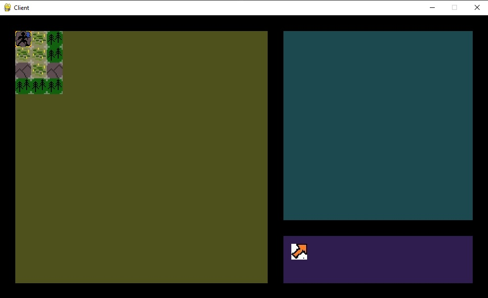

# TBD RPG
A multiplayer RPG game with no title so far. But the most ambitious of course.

There is not a lot to show right now. The server part can hold some map data and player data. The client part can draw 
some UI and the global map based on this data.
# Getting started
Follow these simple instructions to get a copy of a project for personal use and testing.
## Prerequisites
The project uses PostgreSQL so you want it to be installed and ready.

You will also need a fresh new database. 
## Installing
Clone the repository, create a new virtual environment and install all dependencies from a requirements.txt file.
```
pip install -r requirements.txt
```
 
Copy ```local_example.py``` to ```local.py``` and link your database by updating credentials in ```local.py```.

And lastly migrate migrations with migrate command.
```
python manage.py migrate
```
Gratz, you're ready to run it!
## Running
Run ```server/server.py``` to start server and run ```game_clients/client.py``` to start game.
# What it looks like

# TODO
Player movement is currently in work.